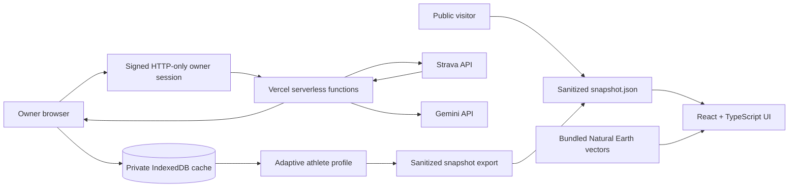

# RunAround

[](https://github.com/NikhileshThiru/runaround/actions/workflows/ci.yml)
**Live demo:** [run-around.vercel.app](https://run-around.vercel.app)

RunAround is a single-athlete running intelligence platform that turns Strava history into an adaptive coaching dashboard and a long-term 3D journey through every U.S. state and around the world.

The application is designed as a portfolio project and a real personal tool. Public visitors receive a sanitized, read-only snapshot. Only the owner can synchronize Strava, request Gemini coaching, inspect private activity data, or publish a new snapshot.

## Product Highlights

- Custom-built Three.js globe with a versioned state-capital-to-world milestone route, raycast milestone tooltips, and cinematic camera flights
- Exact Strava-reported mile, 5K, 10K, half-marathon, and marathon best efforts
- Incremental Strava synchronization with resumable rate-limit-aware history scanning
- Adaptive CTL, ATL, form, weekly mileage, pace, heart-rate, and cadence analysis
- Deterministic coaching safety constraints around fatigue, hard-effort spacing, and mileage progression
- Gemini structured output behind an owner-only serverless proxy
- Sanitized public portfolio mode without GPS data, Strava identifiers, tokens, or private metadata
- Strava-style public kudos counter backed by Upstash Redis with salted-hash visitor dedupe

## Architecture



## Security Model

- Strava access and refresh tokens exist only in encrypted, HTTP-only, same-site cookies.
- OAuth uses a cryptographically random state cookie and validates the granted scope.
- Gemini and Strava server operations require a valid owner session.
- State-changing requests require an exact same-origin request.
- The Strava proxy exposes a fixed operation allowlist and never accepts arbitrary URLs.
- Latitude/longitude streams are not requested or stored in the MVP.
- Gemini receives strict metric allowlists without activity names, Strava IDs, maps, coordinates, or raw provider extras.
- Public snapshots exclude athlete IDs, Strava activity IDs, activity names, exact times, GPS data, raw streams, gear, and descriptions.
- The kudos counter stores no personal data: visitors are deduplicated by a salted SHA-256 hash of the request IP that expires after 24 hours, and the endpoint degrades to a hidden control when the datastore is absent.

## Route Algorithm

The route is a virtual narrative, not a street-navigation claim. A versioned manifest defines one milestone in every state followed by global milestones. Consecutive segment lengths use the haversine formula. Current position uses spherical interpolation, including date-line and antipodal safeguards.

The U.S. stage uses all 50 state capitals. Country and state outlines are bundled from public-domain Natural Earth GeoJSON, so the globe does not rely on a map CDN at runtime. The globe is a hand-built Three.js scene: a fresnel-shaded opaque sphere, depth-tested vector boundaries, a glowing tube along the traveled great-circle route, raycast milestone tooltips with click-to-fly camera moves, and a pulsing current-position marker. Far-side geometry is occluded by the opaque sphere, and rendering pauses while the globe is off-screen.

All positive-distance Strava activities contribute to **Lifetime Movement**. Progress clamps at the final Atlanta milestone and preserves excess lifetime mileage without automatically looping.

## Local Development

Requirements:

- Node.js 22 or newer
- npm
- Vercel CLI, installed through the project dependencies

```bash
npm install
npm run dev:full
```

Create local values from `.env.example`. Secrets must never receive a `VITE_` prefix; the Strava client ID is intentionally public and is not a credential.

```text
VITE_STRAVA_CLIENT_ID=
STRAVA_CLIENT_SECRET=
GEMINI_API_KEY=
OWNER_PASSWORD_HASH=
SESSION_SECRET=
```

Generate the owner password hash locally:

```bash
npm run owner:hash-password -- "a-long-private-password"
```

## Verification

```bash
npm run typecheck
npm test
npm run test:e2e
npm run build
```

Unit tests cover route integrity, state-polygon coordinate validation, spherical calculations, exact PB extraction, estimated load, EWMA decay, adaptive safety constraints, cache behavior, OAuth/token handling, and provider boundaries. Playwright covers public navigation, responsive overflow, modal keyboard behavior, globe rendering, and mocked owner lock/unlock.

## Public Snapshot Workflow

The repository ships a deterministic demo snapshot so public visitors can explore every feature: a 35-state journey on the globe, lifetime stats and personal bests, twelve recent multi-sport activities with charts, training trends, a static coaching recommendation, and fixed sample weather. The demo data comes from a seeded generator, is validated by the same Zod schema as real exports, and never touches Strava, Gemini, or the forecast API:

```bash
npm run snapshot:demo
```

Publishing different public data is a separate deliberate step. `createPublicSnapshot` in `src/lib/publicSnapshot.ts` is the tested sanitization boundary for building a snapshot from real owner data, and the publish script validates any snapshot file with Zod before replacing `public/data/snapshot.json`:

```bash
npm run snapshot:publish -- ./path/to/snapshot.json
vercel deploy
```

## Training Metric Definitions

- **Baseline:** median running mileage from up to the last six completed Monday-Sunday weeks, provided at least two completed weeks exist. It describes recent normal volume rather than prescribing a target.
- **CTL:** 42-day exponentially weighted average of daily estimated load, representing the slower long-term workload trend.
- **ATL:** 7-day exponentially weighted average of daily estimated load, representing faster-changing short-term fatigue.
- **Form:** CTL minus ATL. Positive values generally indicate more freshness; negative values indicate more accumulated fatigue. It is a workload signal, not a medical assessment.

## Technical Decisions

- The globe is a custom Three.js scene rather than a globe wrapper library, which keeps the lazy renderer chunk under 540 KB raw (≈138 KB gzip, down from 1.75 MB raw with react-globe.gl) while the initial application remains roughly 100 KB gzip.
- Public mode never requests browser geolocation. Visitors see a fixed sample weather card; live weather activates only after owner authentication.

| Decision | Reason |
|---|---|
| TypeScript + Zod | Provider and AI payloads need compile-time and runtime validation. |
| IndexedDB | Activity details and chart streams are too large for synchronous localStorage. |
| Date-keyed localStorage coaching cache | The validated recommendation is small and must be reused at most once per local calendar day. |
| Secure cookies + same-origin proxy | Provider credentials must never enter browser JavaScript. |
| Static public snapshot | Recruiters can explore real results without access to private controls or data. |
| Haversine route instead of road routing | The feature remains deterministic, testable, and independent of a navigation vendor. |
| Bundled Natural Earth vectors | Geography stays sharp and available without a runtime map CDN or photographic Earth texture. |
| Custom Three.js globe scene | Direct control of shaders, camera flights, raycast tooltips, and render pausing at roughly a third of the wrapper-library bundle size. |
| Exact Strava `best_efforts` scan | Personal bests are reported facts, not pace-based estimates. |
| Deterministic coaching guardrails | Safety constraints do not depend on model compliance. |
| Owner-managed Git + Vercel CLI | The owner controls all version history, remotes, and deployments manually. |
