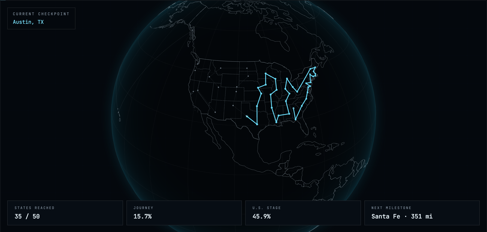
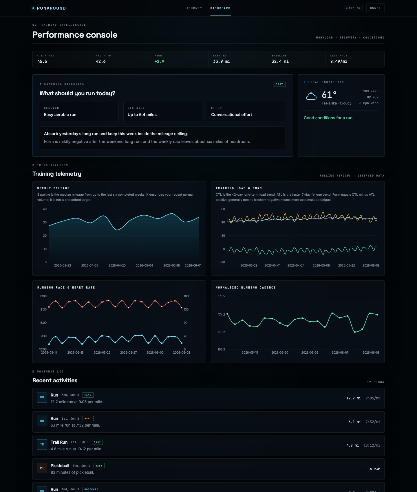
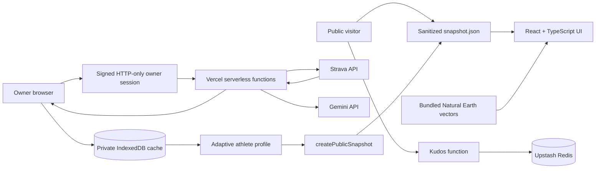

# RunAround

[](https://github.com/NikhileshThiru/runaround/actions/workflows/ci.yml)
**Live demo:** [run-around.vercel.app](https://run-around.vercel.app)

RunAround is a single-athlete running intelligence platform. It turns Strava history into a public-safe portfolio dashboard, a private owner console, and a long-term 3D journey through every U.S. state and around the world.

Public visitors see deterministic demo data from `public/data/snapshot.json`. The owner can unlock private mode to sync Strava, cache activity detail locally, request Gemini coaching through serverless functions, and publish a sanitized snapshot deliberately. Private GPS streams, tokens, Strava IDs, activity names, exact start times, and provider metadata are never included in the public snapshot.





## What To Review

- **Custom globe:** `src/components/Globe/globeScene.ts` and `src/lib/globeRoute.ts` implement a hand-built Three.js globe, depth-tested Natural Earth vectors, great-circle routing, current-position interpolation, tooltip raycasting, and reduced-motion behavior.
- **Athlete intelligence:** `src/lib/athleteProfile.ts` computes adaptive estimated load, CTL, ATL, form, weekly baselines, cadence normalization, and fatigue flags from observed activity history.
- **Provider boundaries:** `api/strava.ts`, `api/gemini.ts`, and `api/_lib/security.ts` keep Strava and Gemini behind owner-only serverless routes, signed HTTP-only cookies, same-origin checks, and strict operation allowlists.
- **Public data safety:** `src/lib/publicSnapshot.ts`, `scripts/generateDemoSnapshot.ts`, and `scripts/publishSnapshot.ts` enforce a static, Zod-validated, denylist-by-construction public artifact.
- **Verification:** Vitest covers algorithms, sync behavior, provider security, AI safety, weather logic, and snapshot sanitation. Playwright covers public navigation, responsive layouts, owner modal behavior, kudos, and activity detail interaction.

## Product Highlights

- Mission-control interface with a cyan HUD design system, dense telemetry, and restrained live-signal glow.
- Versioned Atlanta-to-50-states-to-world virtual route driven by all positive-distance movement.
- Exact personal best model based on Strava-reported `best_efforts`, never average-pace guesses.
- Twelve-week mileage and load charts, thirty-day pace, heart-rate, and cadence trends, and accessible chart summaries.
- Deterministic coaching guardrails before Gemini is called: fatigue floor, hard-effort spacing, and weekly mileage ceiling.
- Owner-only AI assessments cached by activity, with collapsed feed summaries computed locally.
- Sample public weather card without geolocation prompts; live Open-Meteo weather only activates in owner mode.
- Optional public kudos counter through Upstash Redis that disappears when the datastore is not configured.

## Run Locally

Requirements:

- Node.js 22 or newer
- npm

```bash
npm install
npm run dev
```

`npm run dev` is enough to review the public demo. Use `npm run dev:full` when testing Vercel serverless functions and owner-only API flows.

Create local values from `.env.example` only when testing private owner features:

```text
VITE_STRAVA_CLIENT_ID=
STRAVA_CLIENT_SECRET=
GEMINI_API_KEY=
OWNER_PASSWORD_HASH=
SESSION_SECRET=
KV_REST_API_URL=      # optional: kudos counter
KV_REST_API_TOKEN=    # optional: kudos counter
```

All values except `VITE_STRAVA_CLIENT_ID` are server-only. Do not add a `VITE_` prefix to secrets.

Generate the owner password hash locally:

```bash
npm run owner:hash-password -- "a-long-private-password"
```

## Verification

```bash
npm run typecheck
npm run lint
npm test
npm run build
npm run test:e2e
```

The Playwright suite starts a production preview automatically unless `PLAYWRIGHT_BASE_URL` is set.

## Architecture



The public application reads only the static snapshot and bundled geography. Owner mode uses IndexedDB as the private working cache, while Strava tokens remain in encrypted HTTP-only cookies and Gemini requests pass through an owner-only proxy.

## Security Model

- Strava access and refresh tokens never enter browser JavaScript, localStorage, IndexedDB, or public JSON.
- OAuth uses a cryptographically random state cookie and validates the returned scope.
- State-changing API calls require a valid owner session, same-origin `Origin`, and POST.
- The Strava proxy exposes named operations instead of arbitrary URLs and rejects latitude/longitude streams.
- Gemini prompts are built from strict metric allowlists and exclude activity names, Strava IDs, maps, coordinates, gear, raw streams, and provider passthrough fields.
- Public snapshots exclude athlete IDs, Strava activity IDs, names, exact times, GPS data, raw streams, gear IDs, descriptions, external IDs, and private metadata.
- The kudos endpoint stores no personal data: visitor dedupe uses a salted SHA-256 IP hash with a 24-hour expiry and fails closed by hiding the UI.

## Route And Metrics

The globe route is a virtual journey, not a street-navigation claim. A versioned manifest starts in Atlanta, visits every U.S. state capital exactly once, continues through global milestones, and returns to Atlanta. Segment distances use haversine great-circle math, and current position uses spherical interpolation with date-line and numerical edge-case handling.

All positive-distance activities advance **Lifetime Movement**. Progress clamps at the final Atlanta milestone and preserves excess mileage without silently starting another lap.

Training load is intentionally labeled **estimated load score** because it is a project-specific heuristic:

- **CTL:** 42-day exponentially weighted average of daily estimated load.
- **ATL:** 7-day exponentially weighted average of daily estimated load.
- **Form:** CTL minus ATL; positive generally means fresher, negative means more fatigue.
- **Baseline:** median mileage from up to the last six completed Monday-Sunday weeks, with at least two weeks required.

## Public Snapshot Workflow

The committed demo snapshot is deterministic synthetic data generated by:

```bash
npm run snapshot:demo
```

Publishing different public data is deliberate:

```bash
npm run snapshot:publish -- ./path/to/snapshot.json
vercel deploy
```

`snapshot:publish` validates the file with the same public schema used at runtime before replacing `public/data/snapshot.json`.

## Private Deployment Checklist

Provider verification requires the owner's real credentials and external accounts, so these checks are manual when preparing a production deployment:

1. Configure Vercel environment variables from `.env.example`, including optional `KV_REST_API_*` only if kudos should be shared.
2. Set the Strava OAuth callback to the deployed `/api/strava-callback` URL.
3. Verify `/` and `/dashboard` load publicly with no geolocation prompt and no owner controls exposed beyond the locked Owner button.
4. Unlock owner mode, start Strava OAuth, complete the callback, and confirm tokens remain absent from browser storage and URLs.
5. Run an incremental sync, open an activity detail panel, and confirm streams exclude `latlng`.
6. Request a coaching recommendation and confirm Gemini calls go only through `/api/gemini`.
7. Publish a sanitized snapshot only after reviewing that no private fields appear in `public/data/snapshot.json`.

## Technical Decisions

| Decision | Reason |
|---|---|
| React + TypeScript + Zod | Provider, AI, cache, and snapshot boundaries need typed code and runtime validation. |
| Custom Three.js globe | Direct scene ownership enables shaders, depth-tested vectors, camera flights, raycast tooltips, render pausing, and a smaller renderer chunk than a wrapper. |
| IndexedDB private cache | Activity details and chart streams are too large for synchronous localStorage. |
| Date-keyed localStorage coaching cache | The validated daily recommendation is small and should be reused for the local calendar day. |
| Secure cookies + same-origin proxy | Provider credentials must never enter browser JavaScript. |
| Static public snapshot | Recruiters can explore the full product without private credentials or provider calls. |
| Haversine route | The journey stays deterministic, testable, and independent of routing vendors. |
| Exact Strava `best_efforts` scan | Personal bests are reported facts, not inferred from whole-activity pace. |
| Deterministic coaching guardrails | Safety constraints do not depend on model compliance. |
| Owner-managed Git + Vercel CLI | The owner controls version history, remotes, and deployments manually. |
